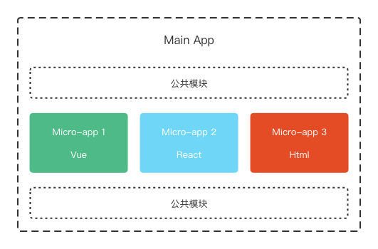

## 初探微前端之single-spa入门

### 1. 微前端概述

#### 1.1 什么是微前端
  - 微前端是一种软件架构，可以将前端应用拆解成一些更小的能够独立开发、部署的微型应用，然后将这些微应用组合使其成为整体应用的架构模式。
  - 微前端建构与框架无关，每个为用用都可以使用不同的框架，甚至不使用框架。
  

#### 1.2 微前端的价值
  - **增量迁移**
    迁移是一项非常耗时且艰难的任务，比如有一个管理系统使用 `JQuery` 开发维护已经有三年时间，但是随时间的推移和团队成员的变更，无论从开发成本还是用人需求上，`JQuery` 已经不能满足要求，于是团队想要更新技术栈，想在其他框架中实现新的需求，但是现有项目怎么办？直接迁移是不可能的，在新的框架中完全重写也不太现实。

    使用微前端架构就可以解决问题，在保留原有项目的同时，可以完全使用新的框架开发新的需求，然后再使用微前端架构将旧的项目和新的项目进行整合。这样既可以使产品得到更好的用户体验，也可以使团队成员在技术上得到进步，产品开发成本也降到的最低。

  - **独立发布**
    在目前的单页应用架构中，使用组件构建用户界面，应用中的每个组件或功能开发完成或者bug修复完成后，每次都需要对整个产品重新进行构建和发布，任务耗时操作上也比较繁琐。

    在使用了微前端架构后，可以将不同的功能模块拆分成独立的应用，此时功能模块就可以单独构建单独发布了，构建时间也会变得加快。

  - **允许单个团队做出技术决策**
    因为微前端构架与框架无关，当一个应用由多个团队进行开发时，每个团队都可以使用自己擅长的技术栈进行开发，也就是它允许适当的让团队决策使用哪种技术，从而使团队协作变得不再僵硬。

> **微前端的使用场景：**
> 1. 拆分巨型应用，使应用变得更加可维护
> 2. 兼容历史应用，实现增量开发

#### 1.3 如何实现微前端
- **多个微应用如何进行组合?**
  在微前端架构中，除了存在多个微应用以外，还存在一个容器应用，每个微应用都需要被注册到容器应用中。

  微前端中的每个应用在浏览器中都是一个独立的 `JavaScript` 模块，通过模块化的方式被容器应用启动和运行。

  使用模块化的方式运行应用可以防止不同的微应用在同时运行时发生冲突。

- **在微应用中如何实现路由？**
  在微前端架构中，当路由发生变化时，容器应用首先会拦截路由的变化，根据路由匹配微前端应用，当匹配到微应用以后，再启动微应用路由，匹配具体的页面组件。

- **微应用与微应用之间如何实现状态共享?**
  在微应用中可以通过发布订阅模式实现状态共享。

- **微应用与微应用之间如何实现框架和库的共享？**
  通过 `import-map`(允许我们加载网络模块) 和 `webpack` 中的 `externals` 属性。

### 2. 模块化解决方案Systemjs

#### 2.1 介绍
  - 在微前端架构中，微应用被打包为模块，但浏览器对模块化的支持不够好，需要使用 [`systemjs`](https://github.com/systemjs/systemjs) 实现浏览器中的模块化。

  - `systemjs` 是一个用于实现模块化（动态的加载模块）的 `JavaScript` 库，有属于自己的模块化规范。

  - 在开发阶段我们可以使用 `ESM` 模块规范，然后使用 `webpack` 将其转换为 `systemjs` 支持的模块。

  示例：
  ```html
  <!DOCTYPE html>
  <html lang="en">
    <head>
      <meta charset="UTF-8" />
      <meta name="viewport" content="width=device-width, initial-scale=1.0" />
      <title>systemjs-vue</title>
      <script type="systemjs-importmap">
        {
          "imports": {
            "vue": "https://cdn.jsdelivr.net/npm/vue@3.2.37/dist/vue.global.min.js",
            "vue-router": "https://cdn.jsdelivr.net/npm/vue-router@4.0.16/dist/vue-router.global.min.js",
            "vuex": "https://cdn.jsdelivr.net/npm/vuex@4.0.2/dist/vuex.global.min.js"
          }
        }
      </script>
      <script src="https://cdn.jsdelivr.net/npm/systemjs@6.12.1/dist/system.min.js"></script>
    </head>

    <body>
      <div id="root"></div>
      <script>
        System.import("./index.js")
      </script>
    </body>
  </html>
  ```

### 3. 微前端框架single-spa

#### 3.1 single-spa 概述
> single-spa 是一个实现微前端架构的框架。

  **`single-spa` 框架中有三种类型的微前端应用：**
  1. `single-spa-application`：微前端架构中的微应用，可以用vue、react、angular 等框架。
  2. `single-spa root config`：创建微前端容器应用。
  3. `utility modules`：公共模块应用，非渲染组件，用于跨应用共享javascript 逻辑的微应用。

#### 3.2 创建容器应用